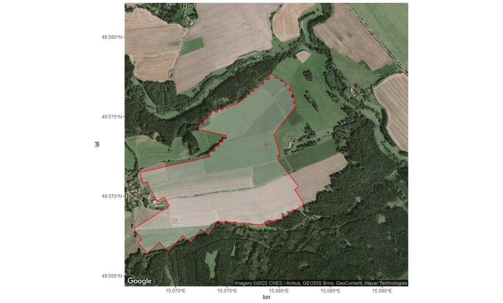

<!-- README.md is generated from README.Rmd. Please edit that file -->

# ROI_boundary

## Overview

Codes to extract and display fetch for defined region of interest. For
further explanations see
<https://github.com/lsigut/EC_workflow#roi-boundary>.

## Set_ROI_boundary.R

Code for extracting fetch distances from reference point (tower) based
on spatial polygon defining region of interest (ROI). ROI boundary
typically represents the outline of the target ecosystem behind which we
do not wish to sample fluxes. This can be due to land-use type behind
the boundary, presence of local CO2 sources, etc. Please note that the
boundary does not define a sharp signal cut-off when using it in
`openeddy::fetch_filter()`. Fetch filter rather assures that only
limited amount of signal comes from behind the boundary (e.g. 30% in
case of distance with 70% signal contribution computed by a 1D footprint
model).

## Display_ROI_boundary.R

Code for visualization of fetch boundary defined by the user as a vector
of distances \[m\] from a reference point (tower). The resulting polygon
shows the interpretation of supplied fetch vector given its angular
resolution. This is useful to compare against the region of interest
from which the fetch was originally extracted to check for large
discrepancies if angular resolution was too low. Please note that the
boundary does not define a sharp signal cut-off when using it in
`openeddy::fetch_filter()`. Fetch filter rather assures that only
limited amount of signal comes from behind the boundary (e.g. 30% in
case of distance with 70% signal contribution computed by a 1D footprint
model). The example visualization for CZ-Krp site is shown below.

## Requirements

-   ROI boundary is expected to be a polygon, tower location is expected
    to be a point. Both spatial objects can be defined by the user in
    any favorite software (e.g. Google Earth, QGIS). CZ-Krp example
    files were created using Google Earth and exported in KML format.
    `sf::st_read()` supports various other inputs, an example of loading
    shapefiles is also included.
-   Google Maps Platform requires a registered API key. In order to run
    `ggmap::ggmap` successfully you need to obtain one from
    <https://cloud.google.com/maps-platform/>. The service is for free
    but it is bound to a credit card, thus cannot be publicly shared.
